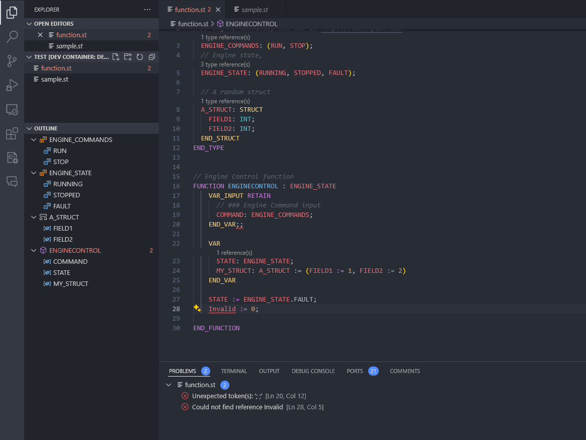
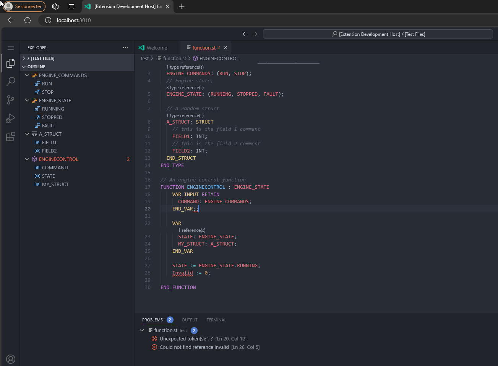

# IEC 61131 LSP

This repository can be seen as the sequel to [Beremiz POC](https://github.com/adclz/refactored-pancake). 

While the first one is mainly focused on implementing TC6 & XSLT processors to easily integrate Beremiz project files, this one is primarly about integrating a parser & lexer leveraging tree-sitter & language server protocol for IEC 61131 specifications.

The current LSP implementation works in both desktop and insiders versions of any vscode IDE.

<div style="display: flex; justify-content: space-around;">
    
    
</div>

## Why tree-sitter

[tree-sitter](https://tree-sitter.github.io/tree-sitter/) is a fairly recent (2018) language-agnostic parser generator.

It has the following advantages:
 - Incremental parsing: Inital load of all data, then only code changes are taken into account.
 - Non-failing parser: Errors are recoverable, moreover code analysis keeps working regardless of current errors.
 - Grammar is written in js, similar to EBNF syntax, allowing us to leverage js powerful features.
 - Comments parsing.
 - C file generation: The CLI tool generates a C file ready for editing, and not an executable.
 - Mulitple language bindings: Once the C file is generated, the CLI also provides bindings for various languages.

You can find a more complete list of tree-sitter advantages & weaknesses on [semantic repository](https://github.com/github/semantic/blob/main/docs/why-tree-sitter.md).

tree-sitter has strong community support and is already implemented in the following well-known environments:
 - [Neovim](https://neovim.io/doc/user/treesitter.html)
 - [Emacs](https://lists.gnu.org/archive/html/emacs-devel/2022-11/msg01443.html)
 - [GitHub code navigation](https://docs.github.com/en/repositories/working-with-files/using-files/navigating-code-on-github#about-navigating-code-on-github)
 
 
## Why Language Server Protocol (LSP)

The [LSP](https://microsoft.github.io/language-server-protocol/) is an IDE JSON-RPC protocol initialy launched by Microsoft.

The current features of the latest 3.17 specification are listed [here](https://microsoft.github.io/language-server-protocol/specifications/lsp/3.17/specification/#languageFeatures).

Since its introduction in 2016, many LSP clients have been created for IDEs and the [support for new languages is rapidly growing](https://langserver.org/).

Thus, LSP integration can be seamlessly done in vscode, theia or even more IDEs.

## Features:

The following LSP specifications are either implemented or in progress.

You can see animated examples of some listed features in the examples under the next section.

| Specification                    | Implemented | WIP  |
|----------------------------------|-------------|------|
| textDocument/semanticTokens/range|             | 🚧   |
| textDocument/completion          | ✔️          |      |
| textDocument/documentSymbol      | ✔️          |      |
| textDocument/documentHighlight   | ✔️          |      |
| textDocument/references          | ✔️          |      |
| textDocument/hover               | ✔️          |      |
| textDocument/typeDefinition      | ✔️          |      |
| textDocument/definition          | ✔️          |      |
| textDocument/selectionRange      | ✔️          |      |
| textDocument/prepareRename       |             | 🚧   |
| textDocument/rename              |             | 🚧   |
| textDocument/foldingRange        |             | 🚧   |
| textDocument/signatureHelp       | ✔️          |      |
| textDocument/documentLink        | ✔️          |      |
| textDocument/codeLens            | ✔️          |      |
| workspace/symbol                 | ✔️          |      |

### Comments

Comments are tracked and supported on both types and variables declarations.


Since the LSP defines markdown as a valid format for hover requests, comments can be written in markdown.


Demos of some LSP features currently implemented for the IEC 61131-3-2 grammar:

### textDocument/completion

[Specification](https://microsoft.github.io/language-server-protocol/specifications/lsp/3.17/specification/#textDocument_completion) 


### textDocument/hover

[Specification](https://microsoft.github.io/language-server-protocol/specifications/lsp/3.17/specification/#textDocument_hover) 


### textDocument/references
### textDocument/definition
### textDocument/typeDefinition

[References Specification](https://microsoft.github.io/language-server-protocol/specifications/lsp/3.17/specification/#textDocument_references) 

[Definition Specification](https://microsoft.github.io/language-server-protocol/specifications/lsp/3.17/specification/#textDocument_definition) 

[Type Definition Specification](https://microsoft.github.io/language-server-protocol/specifications/lsp/3.17/specification/#textDocument_typeDefinition) 


### textDocument/folding

[Specification](https://microsoft.github.io/language-server-protocol/specifications/lsp/3.17/specification/#textDocument_foldingRange) 


### textDocument/signatureHelp

[Specification](https://microsoft.github.io/language-server-protocol/specifications/lsp/3.17/specification/#textDocument_signatureHelp) 

Given the following structure declaration:


The signature would be displayed as such:


### textDocument/documentLink

[Specification](https://microsoft.github.io/language-server-protocol/specifications/lsp/3.17/specification/#textDocument_documentLink) 


## Packages

```
├── .vscode
│   ├── launch.json - Launch the VSC extension.
│   └── tasks.json - Tasks to build and watch VSC extension changes.
├── packages
│   ├── parser-iec-61131-3-2 - iec 61131-2-3 tree sitter parser
│   ├── parser-iec-61131-3-3 - iec 61131-3-3 tree sitter parser 
│   ├── vscode-extension
│       └── src
│           ├── client.ts - LSP client integration
│   └── wasi-lsp - Experimental rust WASI rewrite 
```

## WASI rewrite

Rust lsp server which contains tree sitter rust bindings, grammars, lsp-types, lsp-textdocument and some rusty crates.

## Install dependencies

### PreInstall

```sh
pnpm run preinstall && pnpm install
```

>[!NOTE]
> **preinstall** will globally install:
>
> -  node-gyp & tree-sitter-cli.
> -  esbuild & typescript to run the VSC extension.
> **install** will install local dependencies.

### Generate C parser file & bindings

```sh
cd packages/tree-sitter && tree-sitter generate
```

>[!NOTE]
> **generate** will generate bindings alongside the c parser file.
>
> Current bindings will be overriden!.
>
> To avoid this behavior, use ``--no-bindings``.

### Run the extension

In VSC, click on Run and Debug.
Several tasks are available:
 - **Launch Extension**: Launch the VSC extension.
 - **Attach to Server**: Debug the LSP server, run after launching the extension.


### Run vscode insiders

You'll need to run the **open-in-browser** script inside the vscode-extension package.

If you're using WSL, there's a chance the static server launched by [vscode-test-web](https://github.com/microsoft/vscode-test-web) won't work.