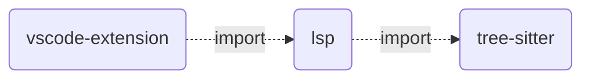

# IEC 61331 Parser & lexer

This repositiory can be seen as the sequel to [Beremiz POC](https://github.com/adclz/refactored-pancake). 

While the first one is mainly focused on implementing TC6 & XSLT processors to easily integrate Beremiz project files, this one is primarly about integrating a parser & lexer leveraging tree-sitter & language server protocol for IEC 61331 specifications.


## Why tree-sitter

[tree-sitter](https://tree-sitter.github.io/tree-sitter/) is a farily recent (2018) language-agnostic parser generator.

It has the following advantages:
 - Incremental parsing: Inital load of all data, then only code changes are taken into account.
 - Non-failing parser: Errors are recoverable, moreover code analysis keeps working regardless of current errors.
 - Grammar is written in js, similar to EBNF syntax, allowing us to leverage js powerful features.
 - Comments parsing.
 - C file generation: The CLI tool generates a C file ready for editing, and not an executable.
 - Mulitple language bindings: Once the C file is generated, the CLI also provides bindings for various languages.

You can find a more complete list of tree-sitter advantages & inconvenients[semantic repository](https://github.com/github/semantic/blob/main/docs/why-tree-sitter.md).

tree-sitter has strong community support and is already implemented in the following well-known environments:
 - [Neovim](https://neovim.io/doc/user/treesitter.html)
 - [Emacs](https://lists.gnu.org/archive/html/emacs-devel/2022-11/msg01443.html)
 - [GitHub code navigation](https://docs.github.com/en/repositories/working-with-files/using-files/navigating-code-on-github#about-navigating-code-on-github)
 
 
## Why Language Server Protocol (LSP)

The [LSP](https://microsoft.github.io/language-server-protocol/) is an IDE JSON-RPC protocol initialy launched by Microsoft.

The goal of the LSP is to provide a single platform-agnostic language server with the IDE acting as a client that sends user code and receives events from the server.

The current features of the latest 3.17 specification are listed [here](https://microsoft.github.io/language-server-protocol/specifications/lsp/3.17/specification/#languageFeatures).

Since its introduction in 2016, many LSP clients have been created for IDEs and the [support for new languages is rapidly growing](https://langserver.org/).

Thus,  LSP integration can be seamlessly done in vscode, theia or even more IDEs.

## Current implementations

| Feature                                | Implemented | WIP |
|----------------------------------------|-------------|-----|
| LSP client                             | ✔️          |     |
| IEC 61331-2 grammar:                   | -           | -   |
| B.0 Programming model                  | ✔️          |     |
| B.1 Common elements                    |             | 🚧  |
| B.1.1 Letters, digits and identifiers  | ✔️          |     |
| B.1.2 Constants                        | ✔️          |     |
| B.1.2.1 Numeric literals               | ✔️          |     |
| B.1.2.2 Character strings              | ✔️          |     |
| B.1.2.3 Time literals                  | ✔️          |     |
| B.1.2.3.1 Duration                     | ✔️          |     |
| B.1.2.3.2 Time of day and date         | ✔️          |     |
| B.1.3 Data types                       | ✔️          |     |
| B.1.3.1 Elementary data types          | ✔️          |     |
| B.1.3.2 Generic data types             | ✔️          |     |
| B.1.3.3 Derived data types             | ✔️          |     |
| B.1.4 Variables                        | ✔️          |     |
| B.1.4.1 Directly represented variables | ✔️          |     |
| B.1.4.2 Multi-element variables        | ✔️          |     |
| B.1.4.3 Declaration and initialization | ✔️          |     |
| B.1.5 Program organization units       |             | 🚧  |
| B.1.5.1 Functions                      |             | 🚧* |
| B.1.5.2 Function blocks                |             | 🚧* |
| B.1.7 Configuration elements           | ✔️          |     |
| LSP server features:                   | -           | -   |
| diagnostics                            |             | 🚧  |
| highlights                             |             | 🚧  |


🚧* current grammar rule is a todo mock.

## Packages

```
├── .vscode
│   ├── launch.json - Launch the VSC extension.
│   └── tasks.json - Tasks to build and watch VSC extension changes.
├── packages
│   └── lsp
│       └── src
│           └── server.ts - LSP server code
│   ├── tree-sitter
│       ├── queries
│           ├── highlights.scm - highlights queries
│           └── indents.scm - indents queries
│       └── grammar.js - IEC 61331-2 grammar 
│   ├── volar-lsp* - experimental volar package   
│   └── vscode-extension
│       └── src
│           ├── client.ts - LSP client integration
```

* The volar-lsp package is still experimental and not yet implemented.

Volar is a [framework](https://volarjs.dev/) designed to simplify the development of language servers using the **@vscode/language-server** package.

It is being used by JetBrains for their IDEs [](https://blog.jetbrains.com/webstorm/2024/04/giving-back-to-the-ecosystem-jetbrains-supports-volar/)

Although it offers great simplification, it is too targeted at web development and might not be suitable for our current needs.



## Install dependencies

### PreInstall

```sh
pnpm run preinstall && pnpm install
```

>[!NOTE]
> **preinstall** will globally install:
> -  node-gyp & tree-sitter-cli.
> -  esbuild & typescript to run the VSC extension.
> **install** will install local dependencies.

### Generate C parser file & bindings

```sh
cd packages/tree-sitter && tree-sitter generate
```

>[!NOTE]
> **generate** will generate bindings alongside the c parser file.
> Current bindings will be overriden!.
> To avoid this behavior, use ``--no-bindings``.

### Run the extension

In VSC, click on Run and Debug.
Several tasks are available:
 - **Launch**: Launch the VSC extension.
 - **Build LSP & Launch**: Build the LSP server and Launch the VSC extension.
 - **Build Parser, LSP & Launch**: Build the parser, LSP server and Launch the VSC extension.